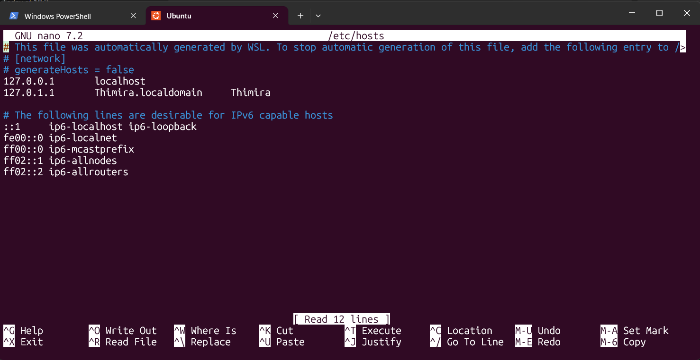
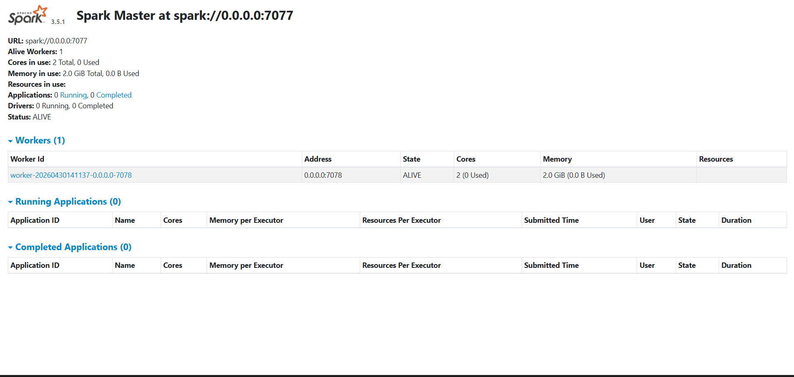
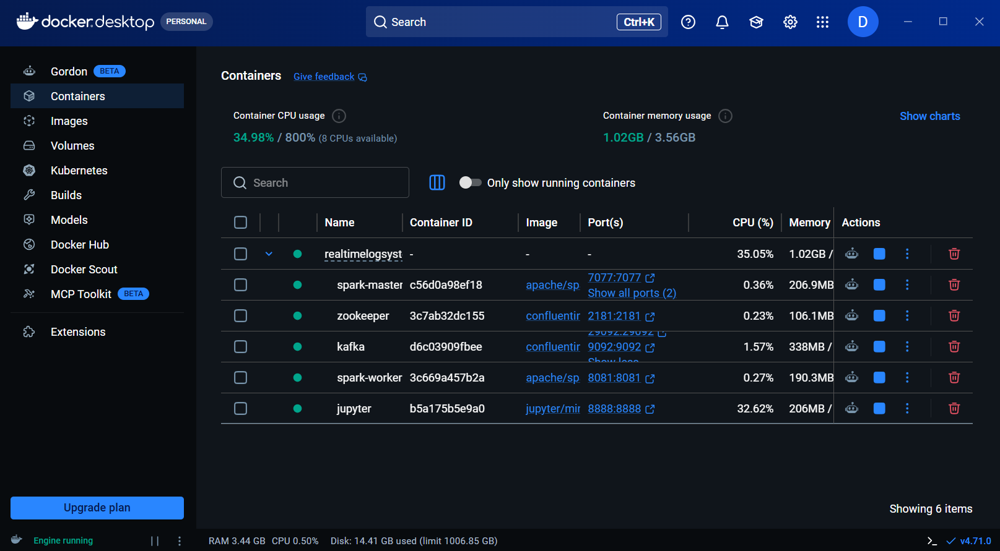

# Real-Time Log Monitoring System Report

## 1. Introduction

Modern software systems produce a continuous stream of logs from APIs, authentication modules, payment services, user management services, notification services, and infrastructure components. These logs contain valuable operational signals, but their volume and velocity make manual analysis slow and unreliable. The objective of this project is to design and implement a distributed real-time log monitoring system that can ingest log events, identify errors, aggregate service-level metrics, detect anomalies, and support alert generation.

The implemented system uses Apache Spark Structured Streaming as the processing engine, with optional Apache Kafka integration for event ingestion. It also includes a synthetic log generator, batch analysis workflow, streaming workflow, monitoring alert rules, Docker-based deployment, and HDFS documentation for scalable storage.

## 2. Problem Definition and Big Data Characteristics

Real-time log monitoring is a big data problem because operational logs are generated continuously by many services and hosts. The monitoring system must process these records quickly enough for alerts to remain useful.

### 2.1 Problem Scenario

Operations teams need to answer questions such as:

- Which services are currently producing the most errors?
- Are response times increasing beyond acceptable thresholds?
- Are there abnormal error spikes within a short time window?
- Which services require immediate attention?
- Can the system process logs continuously instead of waiting for manual batch inspection?

The system addresses these needs by filtering error events, computing metrics over time windows, and flagging high-error or high-latency conditions.

### 2.2 Big Data Characteristics

| Characteristic | Relevance to the Project |
|---|---|
| Volume | Production systems can generate thousands of logs per second. The project simulates configurable log batches and is designed to scale through Spark and Kafka. |
| Velocity | Logs arrive continuously, so the system uses streaming ingestion and five-second trigger intervals for near-real-time processing. |
| Variety | Records include timestamps, service names, hosts, log levels, messages, request IDs, response times, and HTTP status codes. |
| Veracity | Preprocessing validates timestamps, status codes, response times, and schema fields before analysis. |
| Value | Aggregated metrics, anomaly flags, and alerts turn raw logs into operational insight. |

## 3. System Architecture

The system follows a layered architecture:

```text
Log Sources
  - Synthetic JSONL log files
  - Optional Kafka raw-logs topic

Ingestion Layer
  - File stream reader
  - Kafka stream reader

Processing Layer
  - Spark Structured Streaming
  - Schema parsing
  - Timestamp conversion
  - Error filtering
  - Windowed aggregation

Analytics Layer
  - Service-level metrics
  - Host-level metrics
  - Status-code metrics
  - Anomaly detection

Output and Monitoring Layer
  - CSV output for batch results
  - Console output for streaming results
  - Prometheus-style alert rules
  - Grafana dashboard configuration
  - HDFS/local storage support
```

### 3.1 Main Components

| Component | File | Purpose |
|---|---|---|
| Log generator | `scripts/log_generator.py` | Generates synthetic log events with configurable anomaly behavior. |
| Batch analysis | `spark/batch_analysis.py` | Processes historical/sample logs and writes service metrics to CSV. |
| Streaming job | `spark/streaming_job.py` | Reads continuous file or Kafka streams and performs real-time analysis. |
| Configuration | `config/app_config.json` | Controls services, thresholds, Spark settings, Kafka settings, and output paths. |
| Docker stack | `docker-compose.yml` | Runs Kafka, Zookeeper, Spark master, Spark worker, and Jupyter. |
| Alert rules | `monitoring/alert_rules.yaml` | Defines high error rate, critical error rate, response time, lag, and degradation alerts. |
| HDFS guide | `hdfs/HADOOP_INSTALL_UBUNTU.md` | Documents Hadoop/HDFS setup for distributed storage. |

## 4. Data Acquisition and Preprocessing

The project uses generated JSON Lines logs. Each record represents one service event.

Example fields:

| Field | Description |
|---|---|
| `timestamp` | Event time used for windowing. |
| `service` | Source service such as `auth-service` or `api-gateway`. |
| `host` | Source host identifier. |
| `log_level` | Severity level such as `INFO`, `WARNING`, `ERROR`, or `CRITICAL`. |
| `message` | Human-readable event message. |
| `request_id` | Unique request correlation ID. |
| `response_time_ms` | Request or operation latency. |
| `status_code` | HTTP-style status code. |

Preprocessing includes:

- Parsing JSON records into a Spark DataFrame using an explicit schema.
- Converting timestamp strings to Spark timestamp values.
- Casting log levels and numeric fields to expected types.
- Replacing negative response times or status codes with safe values.
- Filtering error events using log level, HTTP status code, and message keywords.

## 5. Processing and Analysis Methods

### 5.1 Error Filtering

The system treats a record as an error event when at least one of these conditions is true:

- `log_level` is `ERROR`, `CRITICAL`, or `FATAL`.
- `status_code` is greater than or equal to 400.
- `message` contains error-related keywords such as `error`, `failure`, `failed`, `exception`, or `critical`.

This filtering step reduces the amount of data processed by later stages and focuses analysis on operationally important events.

### 5.2 Windowed Aggregation

Spark groups records by service and time window. The configured streaming window is 60 seconds with a 10-second slide interval. The batch workflow also uses 60-second service-level windows.

Metrics produced include:

- Event count
- Average response time
- Maximum response time
- Minimum response time
- Server error count
- Client error count
- Error rate
- Processing timestamp

### 5.3 Anomaly Detection

The project uses threshold-based anomaly detection. A service-window record is marked as anomalous when:

- Average response time exceeds the configured threshold.
- Error rate exceeds the configured threshold.

The current configuration uses:

| Setting | Value |
|---|---:|
| Error rate threshold | 0.10 |
| High alert error rate threshold | 0.15 |
| Response time threshold | 5000 ms |
| Critical response time | 10000 ms |

### 5.4 Alerting

The alert rules define conditions for:

- High error rate
- Critical error rate
- High response time
- Spark streaming processing lag
- Consecutive error spikes
- Service degradation

These rules can be connected to a Prometheus and Grafana monitoring setup to support real operational alerting.

## 6. Design Patterns Applied

| Pattern | Implementation | Benefit |
|---|---|---|
| Filtering | Error event extraction using severity, status code, and keywords. | Reduces noise and focuses processing on important records. |
| Aggregation | Grouping by service, host, status code, and time window. | Converts individual logs into meaningful operational metrics. |
| Windowing | 60-second windows and 10-second slides in streaming mode. | Supports trend detection over recent time periods. |
| Sorting | Top failing services are ranked by error count. | Helps prioritize investigation. |
| Threshold detection | Response time and error rate checks. | Provides simple, explainable anomaly detection. |
| Config-driven processing | Thresholds and services are stored in JSON configuration. | Makes the system easier to tune without changing source code. |

## 7. Implementation Summary

The batch pipeline performs these steps:

1. Load configuration from `config/app_config.json`.
2. Read JSONL logs from `data/sample/sample_logs.txt`.
3. Parse and preprocess fields.
4. Filter error events.
5. Compute top failing services.
6. Aggregate metrics by service and 60-second windows.
7. Detect anomalies.
8. Export service metrics to `output/service_metrics/results.csv`.

The streaming pipeline performs similar analysis continuously:

1. Read events from file stream or Kafka topic.
2. Parse JSON using a fixed schema.
3. Filter error events.
4. Aggregate by service using sliding windows.
5. Detect anomalies in real time.
6. Print formatted monitoring output to the console.

## 8. Evaluation and Results

The current sample data contains 100 generated log events in `data/sample/sample_logs.txt`.

### 8.1 Sample Dataset Summary

| Metric | Value |
|---|---:|
| Total log records | 100 |
| Detected error events | 10 |
| Error event percentage | 10.00% |
| HTTP 4xx/5xx events | 10 |
| HTTP 5xx events | 3 |
| Average response time | 521.31 ms |
| Maximum response time | 7345 ms |

### 8.2 Service Distribution

| Service | Records |
|---|---:|
| user-service | 24 |
| api-gateway | 22 |
| auth-service | 20 |
| notification-service | 20 |
| payment-service | 14 |

### 8.3 Log Level Distribution

| Log Level | Records |
|---|---:|
| INFO | 46 |
| DEBUG | 32 |
| WARNING | 19 |
| ERROR | 3 |

### 8.4 Top Services by Detected Error Events

| Service | Error Events |
|---|---:|
| auth-service | 4 |
| api-gateway | 3 |
| user-service | 2 |
| notification-service | 1 |

### 8.5 Exported Service Metrics

The batch analysis generated 4 service-window rows in `output/service_metrics/results.csv`. All 4 rows were marked as anomalies because each service window exceeded the configured error rate threshold.

| Service | Event Count | Average Response Time | Error Rate | Anomaly Type |
|---|---:|---:|---:|---|
| api-gateway | 3 | 157.67 ms | 1.00 | HIGH_ERROR_RATE |
| auth-service | 4 | 682.00 ms | 1.50 | HIGH_ERROR_RATE |
| notification-service | 1 | 118.00 ms | 1.00 | HIGH_ERROR_RATE |
| user-service | 2 | 832.50 ms | 1.50 | HIGH_ERROR_RATE |

The average service-window response time was 447.54 ms, and the maximum service-window response time was 1951 ms.

### 8.6 Metric Definition Note

In the current implementation, `client_error_count` is calculated as all status codes greater than or equal to 400, while `server_error_count` separately counts status codes greater than or equal to 500. Because 5xx responses are included in both counts, the exported `error_rate` can exceed 1.0. This does not break anomaly detection because the value still correctly signals a high-error condition, but for production reporting the client error calculation should use the range 400-499 to avoid double-counting.

## 9. Strengths of the System

- Uses Apache Spark Structured Streaming, which is suitable for scalable, distributed stream processing.
- Supports both batch and streaming analysis modes.
- Includes optional Kafka ingestion for realistic event-stream architecture.
- Separates configuration from code through JSON settings.
- Provides explainable anomaly detection based on response time and error rate thresholds.
- Includes Docker Compose services for reproducible setup.
- Provides HDFS setup documentation for distributed storage.
- Includes monitoring alert rules that can be integrated with Prometheus and Grafana.

## 10. Limitations

- The current sample dataset is small, so evaluation results demonstrate functionality rather than full production scale.
- Threshold-based anomaly detection is simple and explainable, but it may not detect subtle seasonal or service-specific patterns.
- The exported error rate currently double-counts 5xx responses because server errors are also included in the client error count.
- The streaming job currently writes formatted results to the console; a production deployment should also write alerts and aggregates to persistent sinks.
- Kafka support exists in the code, but the default configuration disables Kafka.
- Security features such as authentication, encryption, and access control are outside the current project scope.

## 11. Future Improvements

Recommended improvements include:

- Correct the error-rate formula by counting client errors as status codes from 400 to 499 only.
- Add persistent sinks for alerts, such as Kafka alert topics, databases, or dashboard APIs.
- Add service-specific thresholds because expected latency and error rates differ by service.
- Add machine learning anomaly detection for seasonal trends and unusual patterns.
- Add automated unit and integration tests for preprocessing, filtering, aggregation, and anomaly detection.
- Add Prometheus metric export from the Spark pipeline.
- Store historical outputs in HDFS or cloud object storage using partitioned Parquet.
- Add a dashboard that visualizes error rates, response times, top failing services, and active alerts.

## 12. Conclusion

This project successfully demonstrates a distributed real-time log monitoring architecture using Spark Structured Streaming, optional Kafka ingestion, configurable preprocessing, windowed aggregation, anomaly detection, and alert-rule definitions. The system converts raw logs into actionable service-level metrics and identifies high-error conditions automatically.

The current implementation is suitable as an academic and prototype-level big data solution. With additional production hardening, persistent alert sinks, refined error-rate calculations, and expanded monitoring integrations, it can be extended into a practical operational log monitoring platform.

## 13. Deployment Evidence and Screenshots

The following figures document the local environment and deployment components used to validate the system.

### 13.1 Ubuntu / WSL Host Configuration



Figure 1: Ubuntu/WSL session used to configure the local host environment for the project.

### 13.2 Spark Master Cluster Status



Figure 2: Spark Master dashboard showing the cluster status, worker registration, and available resources.

### 13.3 Docker Container Stack



Figure 3: Docker Desktop showing the running project stack, including Spark, Kafka, Zookeeper, and Jupyter.

